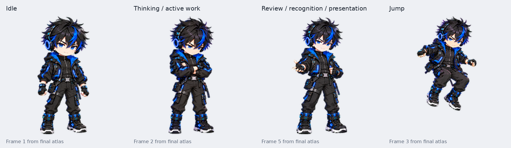
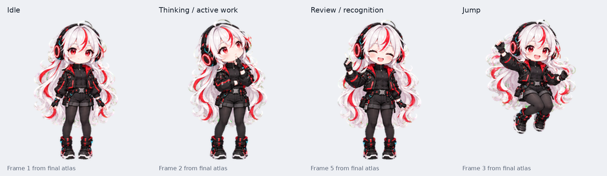

# dots Icon Collection

dots 向けのキャラクター素材集です。

5 キャラクターの透明 PNG スプライトシートと、見た目・動きを確認できる画像、GIF、MP4 を収録しています。

## キャラクター

### [画面ロボ](characters/white-robot/README.md)

白い丸みのある本体、黒い画面、緑色の丸いピクセルの目・口を持つロボットです。手足は付けず、小さなアンテナであいさつします。

[MP4 で動きを確認](characters/white-robot/previews/robot-all-states.mp4) / [GIF](characters/white-robot/previews/robot-all-states.gif)

- 透明 PNG スプライトシート（Pets v2 形式）
- 標準 9 状態のアニメーションと 16 方向の視線
- 画像とフレーム構造の検査済み
- 緑色の処理中表示と、黄色い電球の確認中表示
- 2026-10-06 に既存キャラクターを更新し、dot のプロフィール画像への反映を確認

このプレビューは素材から生成したものです。アプリ上での動作を録画したものではありません。

### [少佐](characters/major/README.md)

立派な口ひげと頼もしい笑顔の、筋肉質なおっちゃんです。以前に制作した立ち絵とアニメーションを収録しています。

[MP4 で動きを確認](characters/major/previews/all-states.mp4) / [GIF](characters/major/previews/all-states.gif)

- 透明 PNG の立ち絵と Pets v2 スプライトシート
- 標準 9 状態のアニメーションと 16 方向の視線
- 既存キャラクターの登録を確認、収録ファイルの形式を再検査済み
- ひらめき・力こぶの追加プレビューも収録

### [cat](characters/cat/README.md)

写真風のキジトラ猫です。通常・考え中・ひらめきの表情を含む、標準 9 状態と 16 方向の視線を収録しています。

[MP4 で動きを確認](characters/cat/previews/preview.mp4) / [GIF](characters/cat/previews/preview.gif)

- 完成した Pets v2 シート、GIF・MP4、全コマ・視線の確認画像
- キャラクター登録済み。今回の追加ではアクティブ化していません

### [Cyber Boy](characters/cyber-boy/README.md)

黒髪に青い差し色、大きなヘッドホンのキャラクターです。腕を組んで考え、気づいて顔を上げ、手を開いて結果を伝えます。

[MP4 で動きを確認](characters/cyber-boy/previews/preview.mp4) / [GIF](characters/cyber-boy/previews/preview.gif)

- 完成した Pets v2 シート、標準 9 状態と 16 方向の視線
- キャラクター登録済み。今回の追加ではアクティブ化していません

### [Cyber Girl](characters/cyber-girl/README.md)

白いウェーブヘアに赤い差し色、大きなヘッドホンのキャラクターです。考える仕草と、確認して気づいたときの表情を収録しています。

[MP4 で動きを確認](characters/cyber-girl/previews/preview.mp4) / [GIF](characters/cyber-girl/previews/preview.gif)

- 完成した Pets v2 シート、標準 9 状態と 16 方向の視線
- キャラクター登録済み。今回の追加ではアクティブ化していません

5 キャラクターとも、標準 9 状態と 16 方向の視線を収録しています。利用条件は下の「利用条件」を確認してください。

## 収録内容

- `characters/white-robot/` — 画面ロボの素材とプレビュー
- `characters/major/` — 少佐の素材とプレビュー
- `characters/cat/` — cat の素材とプレビュー
- `characters/cyber-boy/` — Cyber Boy の素材とプレビュー
- `characters/cyber-girl/` — Cyber Girl の素材とプレビュー
- 各キャラクターの `assets/` — 透明 PNG スプライトシートや立ち絵
- 各キャラクターの `previews/` — 動き、全コマ、視線方向のプレビュー
- 各キャラクターの `manifest.json` — 形式、フレーム配置、ファイルサイズ、SHA-256
- 各キャラクターの `SHA256SUMS` — 素材ファイルのチェックサム
- [対応形式と動作確認](docs/compatibility.md)
- [配布前の確認事項](docs/release-checklist.md)

## 確認・登録のしかた

1. 各キャラクターの画像で見た目を、MP4 または GIF で動きを確認します
2. キャラクターのページから「透明 PNG スプライトシート」を開き、元の PNG を保存します。プレビュー動画やコマ一覧ではなく、`assets/` の PNG が登録用です
3. Pets v2 のカスタムペット登録機能が使える環境で、その PNG を自分の dot に添付し、カスタムペットとして登録するよう依頼します
4. 登録成功を確認してから、必要ならそのキャラクターへの切り替えを依頼します

登録機能の利用可否は環境によります。登録とアクティブなキャラクターへの切り替えは別の操作です。このコレクションでは登録と素材検査を確認していますが、各利用環境での実際の再生や状態遷移までは確認していません。

## 利用条件

利用条件のライセンスはまだ設定していません。公開・閲覧・ダウンロードできることは、再配布、改変、商用利用の許可を意味しません。MIT、CC0 などのライセンスは付与していません。
