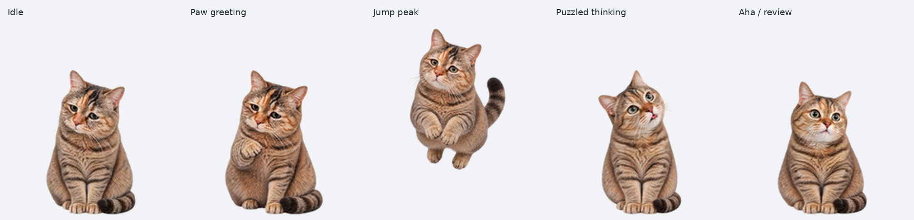

# cat

写真のような毛並みのキジトラ猫です。通常のまばたき、目を見開くひらめき、首を傾げる考え中の表情で作業を見守ります。

## 素材

- [透明 PNG スプライトシート](assets/spritesheet.png)
- 形式：Pets v2
- 画像サイズ：1536 × 2288 px、RGBA
- 配置：8 列 × 11 行、1 コマ 192 × 208 px
- 使用コマ：73 コマ、未使用の透明セル：15 コマ
- ファイルサイズ：2,585,705 bytes

## アニメーション

1. `idle` — 待機、6 コマ
2. `running-right` — 右への移動、8 コマ
3. `running-left` — 左への移動、8 コマ
4. `waving` — あいさつ、4 コマ
5. `jumping` — ジャンプ、5 コマ
6. `failed` — 失敗時の表情、8 コマ
7. `waiting` — 返事や入力を待つ動き、6 コマ
8. `running` — 作業中・考え中、6 コマ
9. `review` — 結果の確認、6 コマ
10. 視線 0°〜157.5° — 8 コマ
11. 視線 180°〜337.5° — 8 コマ

### 表情と仕草

- `idle`：通常の表情とまばたき
- `running`：首を傾げる、考え中の表情
- `review`：目を見開く、ひらめき・結果確認の表情
- `waiting`：入力や返事を待つ、低い位置で前足を出す仕草

考え中・ひらめきの各状態は、その表情を保つようにしています。

状態の切り替えタイミングはアプリが制御します。

## プレビュー

- [全状態の MP4](previews/preview.mp4)
- [全状態の GIF](previews/preview.gif)
- [主な動きの静止画](previews/preview-stills.png)
- [全コマ一覧](previews/contact-sheet.png)
- [視線方向一覧](previews/look-directions.png)
- [コンセプト画像](assets/concept.png)
- [16 方向の視線 GIF](previews/look-loop.gif)
- [待機→ジャンプ→待機 GIF](previews/idle-jump-idle.gif)

動画と確認画像は、完成したスプライトシートから作ったプレビューです。アプリ内の再生を録画したものではありません。

## 確認状況

標準 9 状態と 16 方向の視線を含む素材が完成し、構造・画質・動き・視線方向の検査とプレビュー確認を通過しています。2026-10-06 にキャラクター登録と登録一覧への反映を確認しました。

今回のコレクション追加では、アクティブなキャラクターへの切り替えは行っていません。アプリ内の実際のアニメーション再生と状態遷移は未確認です。詳しくは[対応形式と動作確認](../../docs/compatibility.md)を参照してください。

## ファイルの確認

[manifest.json](manifest.json) と [SHA256SUMS](SHA256SUMS) にファイル一覧、サイズ、チェックサムを記録しています。配布時の利用条件は、コレクション全体と同様に未決定です。
