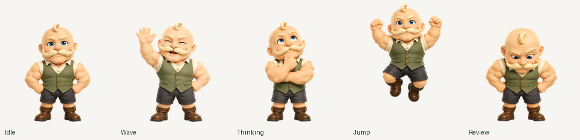

# 少佐

立派な口ひげと頼もしい笑顔の、筋肉質なおっちゃんです。以前に制作した「秘書のおっちゃん」の絵とアニメーションを、そのまま収録しています。

## 素材

- [立ち絵の透明 PNG](assets/mascot-transparent.png) — 192 × 208 px
- [透明 PNG スプライトシート](assets/spritesheet-extended.png) — 1536 × 2288 px、RGBA、2,184,535 bytes
- 形式：Pets v2
- 配置：192 × 208 px のセル、8 列 × 11 行
- 使用コマ：73 コマ、未使用の透明セル：15 コマ

再描画や新しいキャラクターへの置き換えは行っていません。

## スプライトシートの内容

1. `idle` — 待機、6 コマ
2. `running-right` — 右への移動、8 コマ
3. `running-left` — 左への移動、8 コマ
4. `waving` — あいさつ、4 コマ
5. `jumping` — ジャンプ、5 コマ
6. `failed` — 失敗時の表情、8 コマ
7. `waiting` — 返事や入力を待つ動き、6 コマ
8. `running` — 考え中の動き、6 コマ
9. `review` — 確認する動き、6 コマ
10. 視線 0°〜157.5° — 8 コマ
11. 視線 180°〜337.5° — 8 コマ

## プレビュー

- [全状態の GIF](previews/all-states.gif) / [MP4](previews/all-states.mp4)
- [16 方向の視線 GIF](previews/look-loop.gif) / [MP4](previews/look-loop.mp4)
- [待機→ジャンプ→待機 GIF](previews/idle-jump-idle.gif) / [MP4](previews/idle-jump-idle.mp4)
- [全コマ一覧](previews/contact-sheet.png)
- [視線方向一覧](previews/direction-sheet.png)

個別の 9 状態の GIF も `previews/` に収録しています。

## 追加の動き見本

以前に作成した動き見本も `extras/` に残しています。

- [ひらめきの GIF](extras/aha.gif) / [MP4](extras/aha.mp4) / [静止画](extras/aha-stills.png)
- [力こぶの GIF](extras/flex.gif) / [MP4](extras/flex.mp4) / [静止画](extras/flex-stills.png)

これらは追加のプレビューです。標準 9 状態に加えてアプリが自動再生する機能や、追加イベントの対応を示すものではありません。

## 確認状況

2026-10-06 に収録用の元ファイルを再検査し、Pets v2 の形式検査を通過しています。既存のキャラクター登録も確認しています。

収録したシートは以前の納品ファイルです。登録サービス上の現行ファイルとのバイト単位の照合は未完了です。今回、キャラクターの再登録、更新、アクティブ化は行っていません。

詳しくは[対応形式と動作確認](../../docs/compatibility.md)、[ファイル一覧](manifest.json)、[チェックサム](SHA256SUMS)を参照してください。
