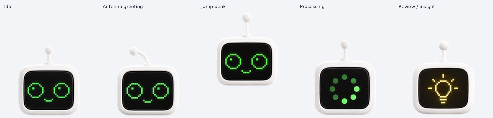

# 画面ロボ

白い丸みのある本体と黒い画面を持つ、小さなロボットです。緑色の丸いピクセルの目・口とアンテナで表情や動きを表現します。手足は付けません。

## 素材

- [透明 PNG スプライトシート](assets/spritesheet-extended.png)
- 形式：Pets v2
- 画像サイズ：1536 × 2288 px、RGBA
- 配置：8 列 × 11 行
- 1 コマ：192 × 208 px
- 使用コマ：73 コマ、未使用の透明セル：15 コマ
- ファイルサイズ：1,667,883 bytes

## アニメーション

行順は次のとおりです。未使用セルは透明です。

1. `idle` — 待機、6 コマ
2. `running-right` — 右への移動、8 コマ
3. `running-left` — 左への移動、8 コマ
4. `waving` — アンテナであいさつ、4 コマ
5. `jumping` — ジャンプ、5 コマ
6. `failed` — 失敗時の表情、8 コマ
7. `waiting` — 待ち時間の表情、6 コマ
8. `running` — 処理中の緑色の回転ドット表示、6 コマ
9. `review` — 確認中の黄色い電球表示、6 コマ
10. 視線 0°〜157.5° — 8 コマ
11. 視線 180°〜337.5° — 8 コマ

黄色い電球は `review` の全 6 コマに表示されます。状態の切り替えタイミングはアプリが制御します。実際に「ひらめいた」瞬間の自動検知や、「回答の直前」専用のタイミング指定には対応していません。

## プレビュー

- [9 状態の GIF](previews/robot-all-states.gif) / [MP4](previews/robot-all-states.mp4)
- [16 方向の視線 GIF](previews/robot-look-loop.gif)
- [待機→ジャンプ→待機 GIF](previews/idle-jump-idle.gif)
- [全コマ一覧](previews/robot-contact-sheet.png)
- [視線方向一覧](previews/robot-directions-overview.png)

プレビューは素材から生成したもので、アプリ上での動作録画ではありません。個別状態の GIF も `previews/` に収録しています。

## 確認状況

緑色の目・口・処理中表示と、黄色い電球を反映した版です。素材の構造検査、画質検査、Pets の形式検査、16 方向の視線の確認を通過しています。2026-10-06 に既存キャラクターを更新し、登録後に取得したシートとの画素一致と、dot のプロフィール画像への緑色の反映を確認しました。Work モードのキャラクター選択は変更していません。

アプリ内で実際に再生されるアニメーションや状態遷移は未確認です。ここに収録した GIF・MP4 はスプライトシートから生成したプレビューです。対応状況は[コレクション全体の確認状況](../../docs/compatibility.md)を参照してください。

## ファイルの確認

[manifest.json](manifest.json) にファイル名、サイズ、SHA-256 を収録しています。[SHA256SUMS](SHA256SUMS) は同じファイルのチェックサム一覧です。
